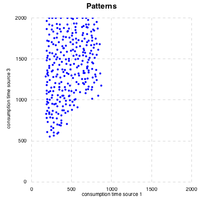
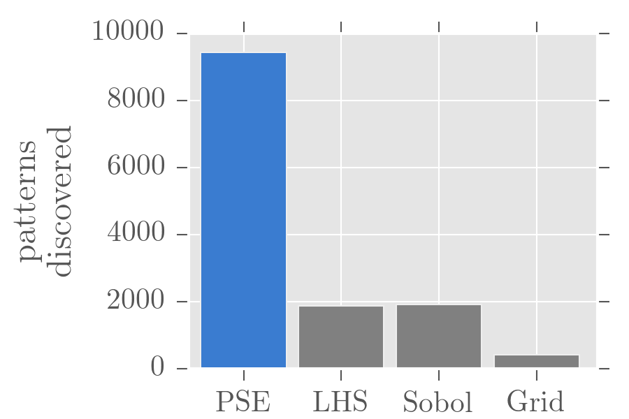

[Version Française](README-fr.md)

# Calibration, validation and sensitivity analysis of complex systems models with OpenMOLE

Guillaume Chérel, 2015-10-23

Translated from French by Guillaume Chérel, Mathieu Leclaire, Juste Raimbault, Julien Perret. Edited by Sarah Wise.

Complex systems models are difficult to explore through simulation because they
can involve many parameters, stochasticity, and nonlinear behaviours. We need to find ways to
solve important modelling problems, including calibration, sensitivity analysis, and
validation. In this tutorial, we will see how evolutionary algorithms can help
us solve these problems for complex systems models, and how to use them in
OpenMOLE.

Script files accompanying this document
----------------------------------------

This document is part of a git repository which also contains the OpenMOLE
script files to execute the experiments presented below, as well as a Haskell source
file to perform the simulation results analysis and plotting. A link to the
corresponding OpenMOLE script is given below in each section title. Please refer to
the [OpenMOLE documentation](http://www.openmole.org/) for directions on how to
use these scripts.

Data analysis and plotting is done with Haskell. The file
[analyses/analyses.hs](analyses/analyses.hs) contains commented functions
for carrying out the analysis. The directory [analyses](analyses) is formatted as a
[Stack](http://www.stackage.org/) project which deals with the necessary
dependencies. To use it, install stack and run:

    $ cd analyses #move into the directory
    $ stack setup #let stack install the right ghc version
    $ stack build #compile the project and install the dependencies
    $ stack exec EAForModelling #generate the figures

You can also generate the figures interactively with ghci. In place of the last
command, use:

    $ stack ghci

This starts the haskell interpreter and you can call functions defined in
analyses.hs directly, such as `plot_ants_calibrate`, `plot_ants_pse` and
`plot_ants_profiles`.

The modelling problem we are trying to address
---------------------------------------------

We are developing a model to explain an observed phenomenon. For
example, we would like to explain the formation of paths by ants between their nest
and a food source. We propose the following mechanism:

- in general, ants move randomly
- when ants find food, they pick some up and go back to the nest
- on their way back, they drop pheromones
- when an ant detect pheromones around it, it moves toward the pheromones
- pheromones evaporate at a given rate (a parameter of the model)
- when pheromones are dropped by an ant, they diffuse with a certain diffusion
  rate (a parameter of the model).

Once this mechanism is proposed, the challenge is to test it and assess its
explanatory or scientific value. These rules can be implemented algorithmically, 
which yields a model that can be simulated. We will use a version of the NetLogo 
model *ants* modified to include additional output variables. It is available in the file
[ants.nlogo](ants.nlogo).

 

The first thing to verify is that the model is able to reproduce the phenomena
it was designed to explain. We are thus looking for parameter values with which
the simulation reproduces the phenomena. This is the problem of
**inverse calibration**. It can be translated into an optimisation problem:
find the parameter values which minimise the distance between experimental
measurements or field data and the simulation results. Evolutionary algorithms
were first designed as optimisation methods and can be used to find solutions to
these kinds of problems.

Knowing that a model can reproduce an observed phenomenon does not guarantee that
it represents the way the phenomenon is actually produced in nature. Other
explanations could be possible. The proposed model is but one candidate among
several possibilities. It is probably out of reach to be certain that it is the
right one, and there can be more than one valid interpretation of the same
phenomena. But we can attempt to test its validity. This is the problem of model
**validation**.

One way to test the model is to look for its different possible behaviours;
that is, not only those we have designed the model to reproduce, but also unexpected ones. By
looking for unexpected behaviours, we can identify those which are
not acceptable, for example because they differ from empirical
data. We also can determine whether certain kinds of behaviours are absent,
which implies the inability of the model to generate such behaviours. These
observations of the model, if they contradict empirical observations, give us the
opportunity to revise the model assumptions or find bugs in the code. They also
give us the opportunity to express new hypotheses to be tested empirically. By
reiterating this process of observation of the simulated model, the formulation of hypotheses, 
the empirical testing of these hypotheses, and model revision in
accordance with the new observations, we can enhance our understanding of the
phenomena and increase our confidence in the models we build.

Identifying the set of distinct behaviours a model can possibly exhibit is not an
optimisation problem, as we are not looking for any one behaviour in particular.
Evolutionary algorithms can help us address this problem by following the
approach of [Novelty Search](http://eplex.cs.ucf.edu/noveltysearch/userspage/),
as we will explain below.

A third important modelling problem is sensitivity analysis. It deals with
understanding how the different model parameters contribute to the behaviour of 
the system. Below, we will propose an approach to sensitivity analysis which leads to
visualising the contribution of each parameter in the reproduction of a target
behaviour. This is the **profiles** method. We will then propose another
approach to evaluate a **calibration's robustness*, i.e. to know if small
variations of the parameters around calibrated values can lead to important
changes in the model's behaviour.

Evolutionary algorithms
-----------------------

Evolutionary algorithms are optimisation methods which were originally inspired
by evolution and natural selection. The general principle is to iteratively generate
new populations of individuals from the previous population, as follows:

1. Generate new individuals by crossover and mutation of the individuals in the
   previous population,
2. Evaluate the new individuals,
3. Select the individuals to keep in the new population.

From this general framework, we can look for the best solutions to a given
problem by selecting from each generation the individuals that are the best at
solving it. We can also prioritise diversity by selecting individuals whose behaviours 
vary most from one another.

Using evolutionary algorithms with models
-----------------------------------------

In the context of complex systems modelling, we are evaluating parameter values
based on the behaviour they induce in the model. The individuals are thus
endowed with a genome which encodes a value for each model parameter. 
Evaluating an individual means executing a model simulation with the parameter
values in the individual's genome and performing desired measures on the model output. The
set of values measured constitute what we will call here a pattern. Each
simulation thus generates a pattern. When the model is stochastic, we can take
the average or median pattern of several simulation replications with the same
parameter values. In the end, an individual is comprised of the genome and its
associated pattern.

In order to solve the modelling problems described above, we will use the
evolutionary algorithms with different objectives:

- the objective of looking for patterns which are the closest to a pattern observed or
  measured experimentally,
- the objective of looking for different patterns.

Calibrate a model to reproduce expected patterns
------------------------------------------------------

*Corresponding OpenMOLE script: [ants\_calibrate/ants\_calibrate.oms](ants_calibrate/ants_calibrate.oms)*

*Corresponding paper: Schmitt C, Rey-Coyrehourcq S, Reuillon R, Pumain D, 2015, "Half a billion simulations: evolutionary algorithms and distributed computing for calibrating the SimpopLocal geographical model" Environment and Planning B: Planning and Design, 42(2), 300-315. <https://hal.archives-ouvertes.fr/hal-01118918/document>*

We will see now how OpenMOLE can help in finding the parameter values with which a
model reproduces a given pattern.

Coming back to the ants example, we can imagine a real world experiment where
three stacks of food are set around the anthill, and the experimenter seeks to measure the 
amount of time required for each stack to be emptied. Assume that the measurements taken from real 
data are respectively 250, 400, and 800 seconds. If the model is accurate, it should be able to 
reproduce these measurements. Are we able to find some parameter values which reproducing these values?

This question can be understood as an optimisation problem, in which we search for the
parameter values which minimise the difference between experimental measured times
and simulated times, given by:

    |250 - simuFood1| + |400 - simuFood2| + |800 - simuFood3|

To answer this question using OpenMOLE, we need a workflow that describes: 

1. how to simulate the model and compute the distance between simulated and
   experimental measures, 
2. how to minimise this distance, 
3. how to parallelise the computations.

The first step corresponds to OpenMOLE basics which will not be detailed here. We
assume that we have defined a `replicateModel` task that executes 10
replications of the model with the given parameter values, computes the median
distance between the simulation outputs and experimental measures (following the
above expression) and associates it with the `foodTimesDifference` prototype.

The second step is tackled using the NSGA2 algorithm, a multi-criteria
optimisation genetic algorithm implemented in OpenMOLE. It takes the following
parameters as inputs: 

- mu: the number of individuals to randomly generate in
order to initialise the population, 
- inputs: the set of model parameters and their range of associated values over
which the optimisation is done,
- objectives: a sequence of variables to be minimised, 
- reevaluate: the
probability of picking a new individual from the existing population in order to
reevaluate it, 
- a termination criterion.

The corresponding OpenMOLE code is the following:

    val evolution =
      NSGA2(
        mu = 200,
        inputs = Seq(diffusion -> (0.0, 99.0), evaporation -> (0.0, 99.0)),
        objectives = Seq(foodTimesDifference), //we have a single objective here
        reevaluate = 0.01,
        termination = 1000000
      )

The variable `foodTimesDifference` is a prototype in the OpenMOLE workflow,
representing the sum of absolute differences between experimental times and
simulated times, as given above. As we are dealing with a stochastic model, its
value is defined in the workflow as the median on some model replications with
the same parameter values. The NSGA2 algorithm will aim to minimise this value.

The parameter `reevaluate` is useful when we have a stochastic model. By chance,
a simulation or a set of replications can lead to a satisfying but 
unreproducible result. It is better to keep individuals which produce good average
results. If an individual has high fitness, it will have a greater chance of being
selected for reevaluation. If its previous performance was due to luck, it will tend to
produce less impressive results and the individual will be abandoned in favour of more robust
individuals.

Finally, we must consider how computation is distributed. OpenMOLE offers several 
approaches to tackle this question for evolutionary algorithms: generational, 
steady state and island steady state.

The first approach entails generating λ individuals during each generation and
evaluating each of them by distributing their evaluation across the different
available computing units. To continue to the next generation, the algorithm must
wait for all individuals to be evaluated, which can lead to a significant
slow-down as resting computing units wait for the slowest individuals to
terminate, in the case of large disparities in computation time among individuals.

The second approach begins with μ individuals and launches a maximal number of
evaluations for as long as there are available computing units. When an evaluation
is completed, it is integrated into the population and a new individual is generated
and evaluated on the computing unit that has just been freed. This method uses
all computing units continuously and is recommended in a cluster environment.

The third approach, island steady state, is particularly well adapted to grid
computing for which access to computational nodes has a consequent entry cost (for
example because of the waiting time for a node to be freed). Instead of
evaluating individuals across a set of distributed computing units, it relies on launching
evolutionary algorithms over a population for a fixed time period (for example 1 hour). 
When the period of time is over, the final population of the algorithm is integrated
into the global population, which allows the system to generate a new population as a
basis for a new distributed evolution.

In our example, we propose to study the simple steady state approach:

    val (puzzle, ga) = SteadyGA(evolution)(replicateModel, 40)

We pass `SteadyGA` the evolution method that was described above and the task
to be executed. The last parameter corresponds to the number of evaluations
to be executed in parallel. `SteadyGA` launches new evaluations as long as the 
number of current evaluations is below this value.

`SteadyGA` returns two variables called, in our example, `puzzle` and `ga`. The
second contains information about the current evolution and allows for the creation of hooks
to export the current population into a csv file or to print the current
generation. The following code saves the population corresponding to each
generation into a file `results/population#.csv`, where `#` is the number of the generation:

    val savePopulationHook = SavePopulationHook(ga, workDirectory / "results")

This line of code displays the generation number in the console:

    val display = DisplayHook("Generation ${" + ga.generation.name + "}")

In OpenMOLE, a puzzle is a set of tasks and transitions that describe a part of
a workflow. The variable `puzzle` contains the OpenMOLE puzzle that does the
evolution. We use this variable to construct the final puzzle that will be
executed and that contains the hooks defined above:

    (puzzle hook savePopulationHook hook display)

When we launch the OpenMOLE workflow, the evolution will produce sets of parameter 
values with increasing fitness, i.e. with which the model output comes closest
to experimental values. We show the evolution of the distance between simulation
and experimental measures between successive evaluations in the following
figure:

 

When the evolution has stabilised, we can conclude whether we have found parameter
values with which the model reproduces experimental data. If so, we
can conclude that the model is a possible explanation of the observed
phenomenon.

|  diffusion|  evaporation|  foodDifference|
|----------:|------------:|---------------:|
|      99.00|         5.37|           53.00|
|      45.19|         8.12|           40.50|
|      27.84|         8.77|           36.00|
|      66.19|         6.74|           56.50|
|      99.00|         5.49|           55.50|
|      64.42|         5.60|           57.50|
|      71.17|         5.61|           15.50|
|      68.10|         5.18|           49.00|
|      78.39|         5.59|           37.00|
|      78.39|         5.57|           57.00|
|      59.09|         3.72|           49.00|
|      51.71|         7.23|           58.50|
|      66.60|         5.26|           52.50|
|      21.36|         8.87|           65.50|
|      64.42|         5.60|           53.50|
|      92.45|         5.30|           58.50|
|      47.85|         6.98|           59.00|
|      68.10|         5.42|           58.50|
|      44.72|         7.09|           60.00|
|      79.39|         5.60|           59.50|

Validation: Putting a model to the test
----------------------------------------

*Associated OpenMOLE Script: [ants\_pse/ants\_pse.oms](ants_pse/ants_pse.oms)*

*Associated Article: Chérel G., Cottineau C., Reuillon R., 2015, " Beyond Corroboration: Strengthening Model Validation by Looking for Unexpected Patterns ", PLoS ONE 10(9): e0138212. doi:[10.1371/journal.pone.0138212](http://journals.plos.org/plosone/article?id=10.1371/journal.pone.0138212)*

As stated above, knowing that a model can reproduce an observed phenomenon does
not ensure its validity, that is to say that we can trust it to explain the
phenomenon in other experimental conditions and that its predictions are valid
with other parameter values. We have already established that one way to test a model 
is to search for the variety of behaviours it can exhibit. The discovery
of unexpected behaviours, if they disagree with the experimental data or the direct
observation of the system it represents, provides us with the opportunity to
revise the assumptions of the model or to correct bugs in the code. This principle also
holds for the absence of expected pattern discovery, which reveals the
inability of the model to produce such patterns. As we test a model and as we
revise it, we can move toward a model we can trust to explain and predict a
phenomenon.

One might wonder, for instance, if in our ant colony model the closest
food source is always exploited before the furthest. Accordingly, we decide to compare the
different patterns that the model generates, looking specifically at the amount time 
the model requires to drain the closest and the furthest food sources.

As in the previous experiment, we consider a task that runs 10 replications of
the model with the same given parameter values and that provides, as its output,
the median pattern described in two dimensions by the variables `medFood1`, the
time in which the closest food source was exhausted, and `medFood3`, the time in
which the furthest food source was exhausted.

To search for diversity, we use the [PSE (Pattern Space
Exploration)](http://journals.plos.org/plosone/article?id=10.1371/journal.pone.0138212)
method. As with all evolutionary algorithms, PSE generates new individuals through a
combination of genetic inheritance from parent individuals and mutation. PSE (inspired
by the [novelty search
method](http://eplex.cs.ucf.edu/noveltysearch/userspage/)) selects for the
parents whose patterns are rare compared to the rest of the population and to
the previous generations. In order to evaluate the rarity of a pattern, PSE
discretises the pattern space, dividing this space into cells. Each time a
simulation produces a pattern, a counter is incremented in the corresponding
cell. PSE preferentially selects the parents whose associated cells have low
counters. By selecting parents with rare patterns, we have a better chance to
produce new individuals with previously unobserved behaviours.

In order to use PSE in OpenMOLE, the calibration utilised in the previous section
is merely run with a different evolution method. We need to provide the following parameters:

- inputs: the model parameters with their minimum and maximum bounds,
- observables: the observables measured for each simulation and within which we
  search for diversity,
- gridSize: the discretisation step for each observable,
- reevaluate and termination have the same meaning as in the calibration
  example.

The following is the OpenMOLE code used for our entomological example:

    val evolution =
        BehaviourSearch (
          inputs =
            Seq(
              diffusion -> (0.0, 99.0),
              evaporation -> (0.0, 99.0)),
          observables =
            Seq(
              medFood1,
              medFood3),
          gridSize = Seq(40, 40),
          reevaluate = 0.01,
          termination = 1000000
        )

As the exploration progresses, new patterns are discovered. The following figure
gives the number of known patterns (the number of cells with a counter value
greater than 0) with respect to the number of evaluations.

 

When this number stabilises, PSE is no longer making new discoveries. One has
to be careful when interpreting this stabilisation. The absence of new discoveries can
mean that all the patterns that the model can produce have been discovered, but
it is possible that other patterns exist but that PSE could not reach them.

The following figure shows the set of patterns discovered by PSE when we interrupt
the exploration after it stabilises.

 

The first observation that can be made is that all patterns have indeed been
discovered: in every pattern, the closest food source has been drained before the furthest one.
Further, there seem to be minimum and maximum bounds on the time period during which
the nearest food source is consumed.

These observations give us starting points for further reflections
on the collective behaviour of the ants. For instance, is the exploration of the
closest food source systematic? Could there be ant species that 
explore further food sources first? If we found such a species, we
would have to wonder which mechanisms make it possible and revise the model to
take them into account. This illustrates how the discovery of the different
behaviours the model is able to produce can lead us to formulate new hypotheses
of the system under study, to test them and to revise the model, thus enhancing
our understanding of the phenomenon.

Why not simply sample the parameter space in order to know the different
potential behaviours of the model using well known sampling methods such as LHS?
In the context of an experiment using a collective motion model with 5
parameters, we compared the performances of PSE and 3 sampling techniques as applied to the parameter
space: LHS, Sobol and a regular grid. The results presented in the next two
figures show that the sampling of the parameter space, even with good coverage
properties such as LHS and Sobol, can miss several patterns. Adaptative methods,
such as PSE, that orient the search according to the discoveries made along the
way, are preferable. The following figure shows the behaviours discovered by the
proposed method (PSE for Pattern Space Exploration), by a LHS sampling, and by a
regular grid.

Each point represents a discovered behaviour of the model. The behaviours are
described in two dimensions: the average velocity of the particles and their
relative diffusion (towards 1, they move away from each other, at 0, they do not
move relatively to each other, towards -1, they get closer to each other).

The following figure allows for the comparison of PSE with other sampling methods in terms of
efficiency.

Sensitivity analysis: Profiles
--------------------------------

*Linked OpenMOLE script: [ants\_profiles/ants\_profiles.oms](ants_profiles/ants_profiles.oms)*

*Article: Reuillon R., Schmitt C., De Aldama R., Mouret J.-B., 2015, "A New Method to Evaluate Simulation Models: The Calibration Profile (CP) Algorithm", JASSS : Journal of Artificial Societies and Social Simulation, Vol. 18, Issue 1, <http://jasss.soc.surrey.ac.uk/18/1/12.html>*

The method we now present focuses on the impact of the different parameters
in order to better understand how they contribute to the model overall. In our Anthills
example, we calibrated the model to reproduce a set of notional
experimental measurements. We would like to know whether the model can reproduce
this pattern for other parameter values. It may be that the model cannot reproduce the 
experimental measurements if a crucial parameter is set to a value other than the one found by the
calibration process. On the other hand, another parameter may prove not to be
essential at all; that is, the model may be able to reproduce the experimental measurements
whatever its value. To establish the relevancy of our model parameters, we will
investigate the parameters' profiles for the model and for the targeted pattern.

We first establish the profile of the evaporation parameter. Specifically, we would 
like to know whether the model can reproduce the targeted pattern with
different evaporation rates. We divide the parameter interval into `nX`
intervals of the same size, and we apply a genetic algorithm to search for values
for other the parameters (the ants model only takes 2 parameters, so that the
dispersal parameter is the only one to be varied), which, as was done previously in the
calibration, minimise the distance between the measurements produced by the
model and the ones observed experimentally. In the calibration case, we kept the
best individuals of the population whatever their parameter values. This time,
we still keep the best individuals, but we keep at least one individual for
each interval division of the profiled parameter (in this case, the evaporation
parameter). Then, we repeat the process with the dispersal parameter.

To set a profile for a given parameter in OpenMOLE, the GenomeProfile
evolutionary method is used:

    val evolution =
       GenomeProfile (
         x = 0,
         nX = 20,
         inputs =
            Seq(
              diffusion -> (0.0, 99.0),
              evaporation -> (0.0, 99.0)),
         termination = 100 hours,
         objective = aggregatedFitness,
         reevaluate = 0.01
       )

The arguments `inputs`, `termination`, `objective` and `reevaluate` have the
same role as in calibration. The argument `objective` is in this instance not a
sequence but a single objective to minimise. The argument `x` specifies the
index of the parameter to be profiled, i.e. its position within the `inputs`
sequence , indexing starting at 0. `nX` is, as explained before, the size of the
discretisation of its range.

As with any evolutionary method, we need for each profile to create an OpenMOLE
puzzle in order to execute it. We define a function which returns the puzzle associated with a
given parameter and use it to assemble all of the pieces into a common
puzzle, as follows :

    def profile(parameter: Int) = {
        val evolution =
           GenomeProfile (
             x = parameter,
             nX = 20,
             inputs =
                Seq(
                  diffusion -> (0.0, 99.0),
                  evaporation -> (0.0, 99.0)),
             termination = 100 hours,
             objective = aggregatedFitness,
             reevaluate = 0.01
           )

        val (puzzle, ga) = SteadyGA(evolution)(replicateModel, 40)
        val savePopulationHook = SavePopulationHook(ga, workDirectory / ("results/" + parameter.toString))
        val display = DisplayHook("Generation ${" + ga.generation.name + "}")
        (puzzle hook savePopulationHook hook display)
    }

    //assemblage
    val firstCapsule = Capsule(EmptyTask())
    val profiles = (0 until 2).map(profile)
    profiles.map(firstCapsule -- _).reduce(_ + _)

We obtain the following profiles :

 

 

When the diffusion rate is set to any value above 10, the model is able to reproduce 
experimental measures rather accurately. A refined profile within the interval 
\[0;20\] may be useful to give a more precise picture of the change in the influence
of the parameter. Model performance is on the contrary strongly sensitive to the evaporation parameter,
as values over 10 lead to a strong increase in minimal fit. When running the
model with a diffusion rate of 21 and evaporation rate of 15, we observe that the
ants are not able to build a sufficiently stable pheromone path between the nest and
furthest food pile, which increases the time needed to exploit it in a
considerable way.

 

Sensitivity analysis: Calibration's robustness
-------------------------------------------------

The last method presented here aims to evaluate the robustness of a model
calibration. By a robust calibration, we mean that small variations of optimal
parameters do not strongly change model behaviour. In other words, there should be
no discontinuity in model indicators in a reasonable region around the optimal
point. As a consequence, if parameter values are restricted to given regions of
the parameter space, we expect the model to have roughly the same behaviour
within each region, especially within the region around the calibrated point.

Let's suppose, for instance, that we can measure the parameter values directly in
the data. Let's also assume that we can establish a confidence interval for each
parameter. We want to be sure that, as long as the parameter values remain within
their respective intervals, the model maintains the same behaviour. This assumption is
important when we try to use the model as a predictive model. If the model
produces behaviours which vary greatly within the considered intervals, the parameters
responsible for this variation should be found and measured with more
accuracy in order to narrow the confidence interval.

This issue can be tackled using the PSE algorithm again, by running the above
example with the desired confidence intervals for each parameter. The algorithm
will aim to diversity of outputs within these interval, and the unveiling of
significantly different patterns will imply that the model is sensitive to some
parameters within the considered region. One must then either narrow parameter
bounds again, or stay cautious on conclusions obtained through the calibrated
model.

Conclusion
----------

The methods developed here suggest an approach to complex
systems modelling and simulation which focuses on the patterns produced as outputs of
simulation. When data on the internal mechanisms of a system or the processes that give rise to
an emerging phenomenon are missing (e.g. because they are not directly observable),
they can be formulated into algorithmic interpretations (models which can be run
in simulation), which serve as candidate explanations of the phenomena. The methods
we present here represent a variety of ways to verify whether these explanations can
reproduce the phenomena they aim to explain (relative to a set of given objectives), to
test their predictive and explicative capabilities, and to analyse the role of
each parameter in their dynamic.

*This text by Guillaume Chérel is under a Creative Commons Attribution - Share
alike 4.0 International license. To obtain a copy of this license, please visit
http://creativecommons.org/licenses/by-sa/4.0/ or send an inquiry to Creative
Commons, 444 Castro Street, Suite 900, Mountain View, California, 94041, USA.*
