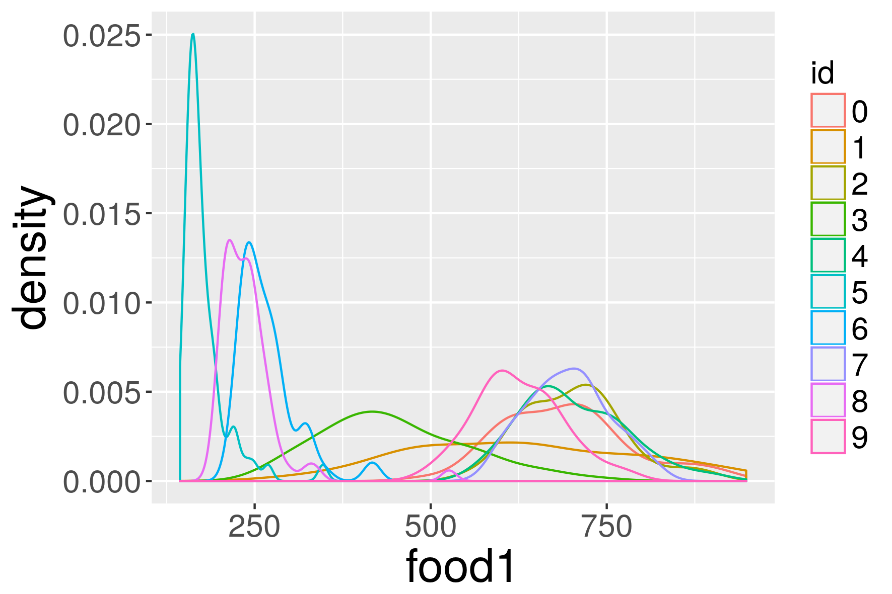
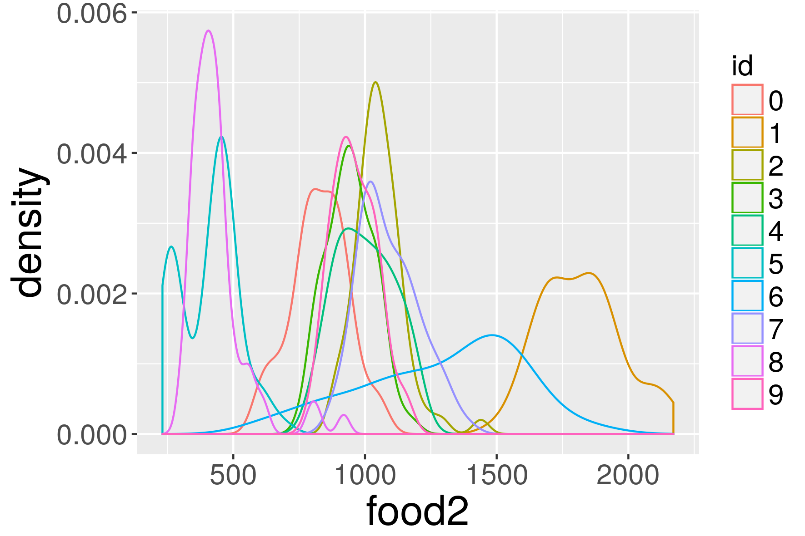
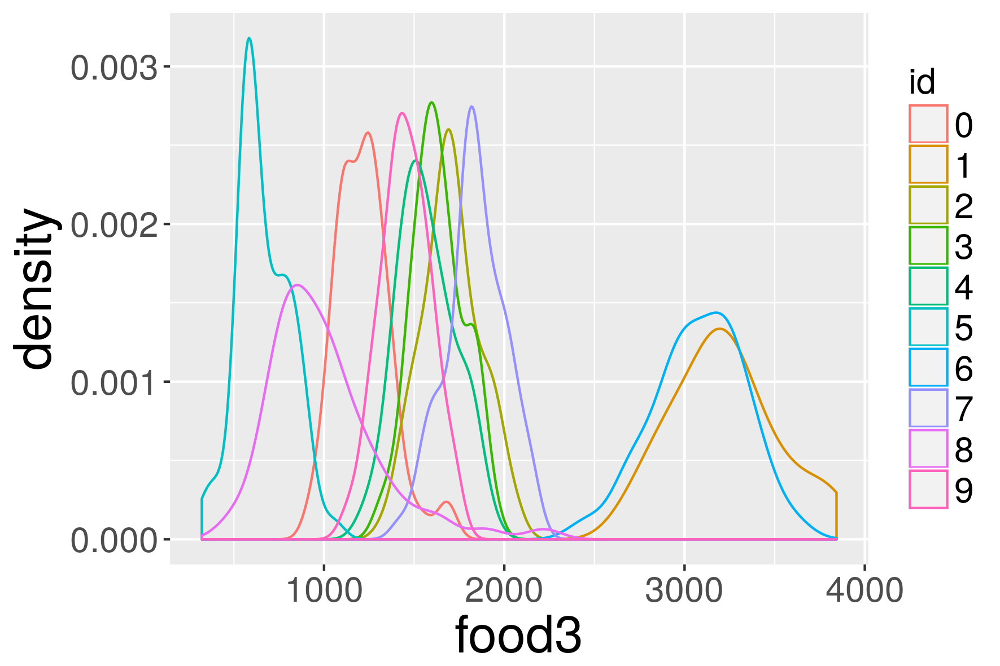

# Extended exploration of ants

This market entry extends the ants NetLogo model (see the [corresponding market entry](../ants)) and illustrates some questions can be asked to a simple model, using simple sampling methods but with heterogenous tasks. In particular, we show the coupling of the exploration task with an RTask.

## Extended model

The model ants is extended, in particular on the following points :
  - supplementary synthetic setups were added : the chooser `setup-type` allows to choose between `fixed` the original setup, `kernel-mixture` a random spatial mixture of exponentials for food density which is then thresholded
  - hidden parameters were put as explicit parameters : `wiggle-angle` is angle smoothing the random walk of ants
  - to study stationary states, an option `infinite-food?` was added, which toggle results in fixed quantities of food regardless of what the ant collect
  - additional indicators were added : for example `carrying-efficiency` evaluates the efficiency of food collection (distance walked to collect food / total distance walked)
  - corrected implementation choices prone to bugs (for example using display to store state of agents), refactorization in "classes" *NetLogo models do not necessary have to be quick and dirty and the langage can be used safely for large models* **TODO : still huge implementation bias in scent procedure : examples of artifacts in path heatmap // others hidden parameters**

## Distribution of indicators

*Script* `Exploration.oms`

At fixed initial configuration, we sample 10 points in the parameter space (4 dimensions : `population`, `wiggle-angle`,`evaporation-rate`,`diffusion-rate`) with a basic LHS sampling, with 64 repetitions for each point. Below are the corresponding indicators distribution for food exhaustion times :

  

*Script* `ExploreDistribution.oms`

With the same *simple* experience plan, we plug a RTask to inline perform a statistical analysis : which type of distribution has a better fit ?

*Note : this could be done within a scala task, but R libraries are sometimes more powerful for precise tasks : here the goodness-of-fit functions, datamining, spatial analysis, etc.*

id  |   food1  |  food2   |   food3
:--:|:--------:|:--------:|:---------:
 0  |  lnorm   |   norm   |  lnorm  
 1  |  gamma   |   lnorm  |  lnorm
 2  |  lnorm   |   logis  |  gamma
 3  |  lnorm   |   norm   |  lnorm
 4  |  lnorm   |   unif   |  lnorm
 5  |  lnorm   |   unif   |  lnorm
 6  |  lnorm   |   unif   |  norm  
 7  |  gamma   |   unif   |  logis
 8  |  lnorm   |  lnorm   |  lnorm
 9  |  gamma   |  lnorm   |  norm

## Optimizing the ant nest

*How to calibrate the model to have a maximal efficiency ?*

## Using the model as a network planner

 - network abstraction
 - network evaluation indicators
