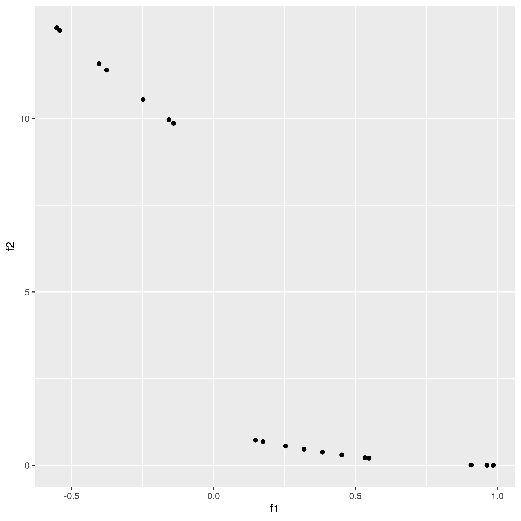
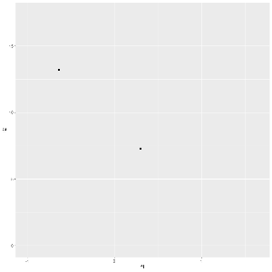
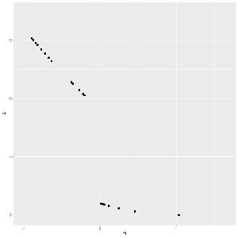

# Genetic Algos Visualizations based on R

## Motivation

When using [Genetic Algorithms in OpenMole](https://next.openmole.org/Genetic+Algorithms.html) for calibration or optimization, it is important for the user to understand what happens over time.
Graphing the evolution of evolutionary methods is also necessary for communication. 

Basic OpenMole features include the exportation of the populations during the evolution as CSV files.
The web interface of OpenMOLE also helps you to plot these CSV files easily in the user interface. 

A simple way for an user to create graphs is to use the [RTask](https://next.openmole.org/R.html) which enables the usage of R 
from OpenMOLE. The first execution of such a task is slow, because OpenMOLE has to download data from the web and build a local container 
with the necessary programs. But later executions reuse the same container and are quicker. 

Producing graphs automatically after exploration and simulation experiments is part of the methodological recommandations for *reproducible research*. The intuition is that doing graphs by hand augments the risks of human error: how to be sure the graph you are including in your paper or presentation is really the one based on the last version of your model, the last simulations, the last exploration of the space of parameters? Producing the graphs automatically along with the simulation results guarantees you a perfect and systematic consistency.

## Optimization Problem

To illustrate visualization, we proposed in the [example_of_optimization.oms](./example_of_optimization.oms) a simple function 
to optimize, and a simple and quick optimization. 
This file is imported in other example workflows. 
So any modification you would produce in this file would impact all the other examples.

## Plot Last Iteration 

The simplest graphic we can do is to plot the Pareto front in the last iteration of the genetic algorithm. 
The example workflow [plot_last_iteration.oms](./plot_last_iteration.oms) provides such a [RTask](https://next.openmole.org/R.html)
which lists the CSV files produced by a simulation, takes the most recently produced one (and not the highest iteration number which might come from an older exploration), and graphs it. 
In this simple example we only graph the 2 dimensionnal space of objectives. 

The RTask returns the produced file as an OpenMOLE File variable. 
We then use the [File Copy Hook](https://next.openmole.org/Hooks.html#Hooktocopyafile) to copy this file produced during the execution into a local file. 

Note that after the success of the execution, you will have to refresh the list of files on the left to view the new files. 

## Plot Every Iteration

The next easier solution is to plot the Pareto front of every iteration. 
We use the [ggplot](https://ggplot2.tidyverse.org/) and [gganimate](https://gganimate.com/articles/gganimate.html) R packages 
which will first analyze the entire file (and adapt the axes accordingly),
then plot each iteration as a different frame. 
In this example we save every image for each iteration into a file. 

The default format is PNG, but you can use the corresponding parameters to switch to one of the various formats offered by the [animate function](https://gganimate.com/reference/animate.html), including jpg, png or vectorial formats more suitable for publication such as EPS or PDF. 

All the images are stored into a directory inside the RTask. 
The directory is returned as a File OpenMOLE variable.
We can use the [File Copy Hook](https://next.openmole.org/Hooks.html#Hooktocopyafile) to copy the entire directory locally. 

After refreshing the list of files in the OpenMOLE interface, you can download the directory containing all the pictures to your computer and browse them easily.

## Render a Video with Evolution

The next step is to concatenate the PNG images produced in the previous example into a video. 
We demonstrate the production of a MP4 video with a strong compression, in order to save bandwith and energy consumption. 

The example [plot_iterations_as_mp4video.oms](./plot_iterations_as_mp4video.oms) installs [the ffmpeg sofware](https://ffmpeg.org/) inside the RContainer to encode the video. 
We call it from the RTask using the standard command line, so you can tune it easily. 

After refreshing the list of files on the left of the OpenMOLE interface, you have to download the video file to view it on your computer.

## Render an interactive Plotly Graph

The previous results provide formats of graphs which can be easily embbed into presentations or publications.
But interactice graphs are better for the user to understand what happens during the evolution.
We demonstrate the usage of the well known [Plotly](https://plotly.com/) which we call from [R](https://www.r-project.org/) using the wonderful [ggplotly](https://plotly.com/ggplot2/extending-ggplotly/) library. 

In this example, the task creates an interactive widget inside a HTML file.
To make it easier for the user, we create a zip archive with all the necessary files. 
Download it, extract it on your computer, and open the html file with a web browser to visualize it.

## Display Pairs

An easy way to discover the dynamics of any code is to plot a diagram showing the relationship between all the variables of a dataset. 
We show a simplistic example in [plot_pairs.oms](./plot_pairs.oms) based on the [amazing GGally R package](http://ggobi.github.io/ggally/) which produces this graph into a PNG file.

## Next Steps

These examples are only a way to show you how you can use standard and powerful R packages to graph the evolution of Genetic Algorithms
in OpenMole. Feel free to forge your own examples and add them to this collaborative repository. 

