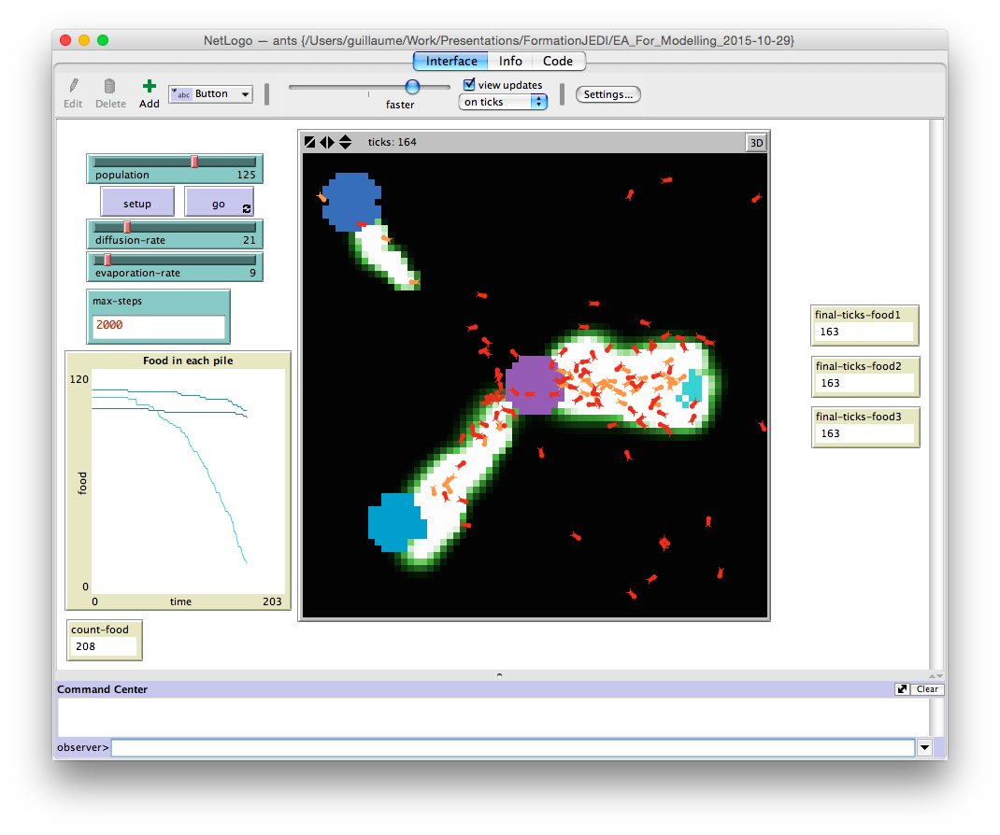
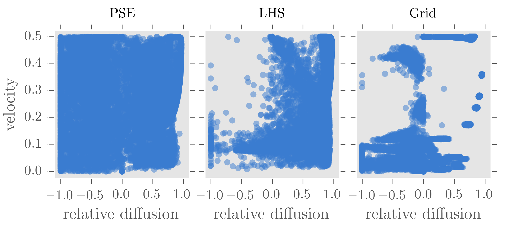
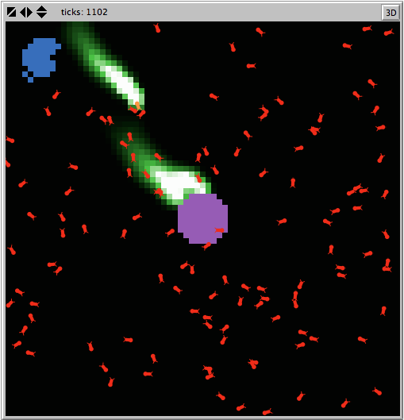

Calibration, validation et analyse de sensibilité de modèles de systèmes complexes avec OpenMOLE
================================================================================================

Guillaume Chérel, 2015-10-23

Les modèles de systèmes complexes sont difficiles à explorer en simulation à
cause du grand nombre de dimensions de l'espace de paramètres, de leur non
linéarité et de leur stochasticité. Il nous faut trouver des moyens de résoudre
les problèmes importants en modélisation, comme la calibration, l'analyse de
sensibilité et la validation. Dans cette formation, nous allons voir comment les
algorithmes évolutifs peuvent nous aider à résoudre ces problèmes pour des
modèles de systèmes complexes, et comment les utiliser dans OpenMOLE.

Fichiers scripts accompagnant ce document
-----------------------------------------

Ce document fait partie d'un dépôt git qui contient aussi les fichiers scripts
OpenMOLE pour exécuter les expériences décrites ci-dessous, et un fichier source
Haskell pour analyser les résultats de simulation et créer les figures. Un lien
vers le script OpenMOLE associé est donné en tête des sections qui décrivent des
méthodes. Référez-vous à la [documentation OpenMOLE](http://www.openmole.org/)
pour l'utilisation de ces scripts.

L'analyse de données et la production des figures est faite en Haskell. Le
fichier [analyses/analyses.hs](analyses/analyses.hs) contient les fonctions commentées qui
réalisent les analyses. Le répertoire [analyses](analyses) prend la forme d'un projet
[Stack](http://www.stackage.org/) qui se charge de l'installation de toutes les
dépendances requises. Pour l'utiliser, installez stack puis exécutez les
commandes suivantes:

    $ cd analyses #pour se déplacer dans le répertoire concerné
    $ stack setup #pour que stack installe la version de ghc nécessaire
    $ stack build #pour compiler le projet et installer les dépendances 
    $ stack exec EAForModelling #pour générer toutes les figures

Il est aussi possible de générer les figures interactivement avec ghci. Au lieu
de la dernière ligne ci-dessus, utilisez:

    $ stack ghci

L'interpréteur haskell est lancé et il vous est possible d'appeler directement
des fonctions comme `plot_ants_calibrate`. Référez-vous au fichier
<analyses/analyses.hs> pour connaître les fonctions disponibles.

Problèmes de modélisation que l'on cherche à traiter
----------------------------------------------------

On se place dans le cas où l'on écrit un modèle pour essayer d'expliquer un
phénomène observé. Par exemple, on souhaite expliquer la formation d'une file de
fourmis entre le nid et une source de nourriture. On propose l'explication
suivante:

-   en général les fourmis se déplacent aléatoirement,
-   lorsqu'elles trouvent de la nourriture, elles en ramassent et retournent au
    nid,
-   sur leur chemin de retour, elles déposent des phéromones,
-   lorsqu'une fourmi détecte des phéromones autour d'elle, elle se déplace dans
    la direction des phéromones les plus forts,
-   les phéromones s'évaporent au cours du temps à un taux d'évaporation donné
    (paramètre),
-   lorsque des phéromones sont déposées, elles s'étalent autour de l'endroit où
    elles sont déposées avec un taux de diffusion donné (paramètre).

Une fois que cette proposition d'explication est faite, la difficulté est de la
tester et de la mettre à l'épreuve pour qu'elle ait une valeur scientifique. Ces
règles peuvent être implémentées sous forme algorithmique, ce qui donne un
modèle qui peut être simulé. Nous utiliserons une version modèle NetLogo *ants*
modifiée pour l'utilisation avec OpenMOLE qui inclut des variables de sorties
supplémentaires. Le modèle modifié est disponible dans le fichier
[ants.nlogo](ants.nlogo).

 

La première chose à vérifier est qu'il est capable de reproduire les phénomènes
que l'on cherche à expliquer. On cherche donc des valeurs de paramètres avec
lesquelles le modèle en simulation reproduit le phénomène. Ce problème est celui
de la **calibration inverse**. Il peut être traduit en un problème
d'optimisation: trouver les valeurs de paramètres qui minimisent la distance
entre des mesures effectuées sur le phénomène qui nous intéresse et les
résultats de simulation. Les algorithmes évolutifs sont à l'origine des méthodes
d'optimisation qui permettent de trouver des solutions à ce genre de problème.

Savoir qu'un modèle est capable de reproduire un phénomène observé ne nous
assure pas qu'il représente effectivement la manière dont le phénomène est
produit dans la nature. D'autres explications pourraient être possibles. Le
modèle proposé n'en est qu'une parmi d'autres. Obtenir la certitude qu'il est le
bon est sans doute hors de portée, et il peut exister plusieurs interprétations
valides d'un même phénomène. Mais nous pouvons tenter de le mettre à l'épreuve
pour tester sa validité. C'est le problème de la **validation** de modèle.

Une manière de mettre le modèle à l'épreuve est de rechercher ses différents
comportements possibles d'un modèle, c'est-à-dire non seulement les
comportements que l'on s'attend à reproduire, mais aussi les comportement
inattendus. En cherchant les comportements inattendus, on se donne une chance
d'en trouver qui ne sont pas acceptables, par exemple parce qu'il sont en
désaccord avec des données expérimentales. On se donne aussi une chance de
remarquer que certains types de comportements sont absents, et de l'interpréter
comme l'incapacité du modèle à les générer. Ces observations, si elles sont
contredites par des observations du système en laboratoire ou in situ, nous
donne l'occasion de réviser le modèle (ou de trouver des bugs dans le code).
Elles nous donnent aussi, par la même occasion, celle de formuler de nouvelles
hypothèses à tester sur le système étudié. En réitérant ce processus
d'observation du modèle en simulation, formulation d'hypothèse, vérification
d'hypothèses sur le système par l'expérience ou l'observation, et de révision du
modèle en accord avec les nouvelles observations, on peut améliorer notre
compréhension du phénomène et construire des modèles en lesquels on peut avoir
de plus en plus confiance.

Rechercher les différents comportements possibles d'un modèle n'est pas un
problème d'optimisation puisqu'on ne cherche pas un comportement particulier.
Les algorithmes évolutifs peuvent aussi nous permettre d'aborder ce problème en
suivant l'approche de la [recherche de
nouveauté](http://eplex.cs.ucf.edu/noveltysearch/userspage/), comme nous
l'expliquerons plus bas.

Un troisième problème important en modélisation est celui de l'analyse de
sensibilité. Il s'agit de comprendre comment les différents paramètres d'un
modèle contribuent à son comportement. Ci-dessous, nous proposerons une approche
de l'analyse de sensibilité qui permet de visualiser à quel point chaque
paramètre est à lui seul important pour permettre au modèle de reproduire un
phénomène souhaité. C'est la méthode des **profiles**. Nous proposerons ensuite
une autre approche qui permet d'évaluer la **robustesse d'un calibrage**,
c'est-à-dire de voir si de faibles variations des paramètres d'un modèle calibré
risque de produire d'important changements de comportements du modèle.

Algorithmes évolutifs
---------------------

Les algorithmes évolutifs sont à l'origine des méthodes d'optimisation qui
s'inspirent de l'évolution et de la sélection naturelle. Le principe général est
de générer itérativement de nouvelles populations d'individus à partir de la
population précédente comme suit:

1.  Générer de nouveaux individus par recombinaison et mutation des individus de
    la population précédente
2.  Évaluer les nouveaux individus
3.  Sélectionner les individus à conserver dans la nouvelle population

À partir de ce cadre général, on peut rechercher les meilleures solutions à un
problème donné en sélectionnant à chaque génération les individus qui résolvent
le mieux le problème. On peut aussi rechercher de la diversité en sélectionnant
les individus qui ont les comportements les plus différents les uns des autres.

Utiliser des algorithmes évolutifs avec des modèles
---------------------------------------------------

Dans le cadre de la modélisation de systèmes complexes, on cherche des valeurs
de paramètres en fonction des comportements qu'ils induisent dans le modèle. Les
individus sont donc composés d'abord d'un génome qui donne une valeur pour
chaque paramètre du modèle. L'évaluation de l'individu correspond à exécuter le
modèle avec les valeurs de paramètres du génome et à mesurer des indicateurs
souhaités sur la sortie du modèle. On parle de motif pour désigner l'ensemble de
ces indicateurs. Chaque simulation génère donc un motif. Lorsque le modèle est
stochastique, on peut prendre le motif moyen ou médian sur plusieurs
réplications avec les mêmes valeurs de paramètres. L'individu complet est décrit
par un génome et le motif associé.

Pour résoudre les problèmes mentionnés ci-dessus, on va utiliser des algorithmes
évolutifs avec différents objectifs: 

- rechercher les motifs qui se rapprochent le plus d'un motif observé ou mesuré
  expérimentalement 
- rechercher des motifs différents

Calibrer un modèle pour reproduire des motifs attendus
------------------------------------------------------

*Script OpenMOLE associé: [ants\_calibrate/ants\_calibrate.oms](ants_calibrate/ants_calibrate.oms)*

*Article associé: Schmitt C, Rey-Coyrehourcq S, Reuillon R, Pumain D, 2015, "Half a billion simulations: evolutionary algorithms and distributed computing for calibrating the SimpopLocal geographical model" Environment and Planning B: Planning and Design, 42(2), 300-315. <https://hal.archives-ouvertes.fr/hal-01118918/document>*

Voyons comment OpenMOLE peut nous aider à rechercher des valeurs de paramètres
avec lesquels un modèle reproduit un motif que l'on cherche à expliquer.

Reprenons l'exemple des fourmis. Imaginons que l'on ait fait une expérience où
l'on a placé trois sources de nourriture autour d'une fourmilière, et que l'on
ait mesuré le temps passé pour que chaque source soit entièrement épuisée. On a
mesuré que la première source a été épuisée en 250 secondes, la deuxième en 400
secondes et la troisième en 800 secondes. Si notre modèle est juste, il devrait
pouvoir reproduire ces mesures. Peut-on trouver des valeurs de paramètres pour
lesquels il les reproduit?

On peut traduire cette question en un problème d'optimisation. Il s'agit de
rechercher des valeurs de paramètres qui minimisent la différence entre les
temps mesurés dans l'expérience et les temps mesurés en simulation, donné par
l'expression:

    |250 - simuFood1| + |400 - simuFood2| + |800 - simuFood3|

Pour répondre à cette question avec OpenMOLE, il faut écrire un workflow qui décrit: 

1. comment simuler le modèle et calculer la distance entre la simulation et les
   mesures issues de l'expérience, 
2. comment minimiser cette distance, 
3. comment distribuer les calculs en parallèle.

Le premier point relève de notions de base d'OpenMOLE dans lesquels nous ne
rentrerons pas ici en détails. Admettons simplement que nous avons une tâche
replicateModel qui exécute 10 réplications du modèle avec des valeurs de
paramètres données, et qui calcule la distance médiane entre les résultats des
simulations et des mesures expérimentales (basée sur l'expression ci-dessus), et
associe au prototype foodTimesDifference.

Pour répondre au second point, OpenMOLE nous permet d'utiliser l'algorithme
NSGA2, qui est un algorithme génétique d'optimisation multi-critères. Dans
OpenMOLE, NSGA2 prend les paramètres suivants: 

- mu: un nombre d'individus à générer aléatoirement pour initialiser la
  population, 
- inputs: une séquence de paramètres du modèle pour lesquels on cherche des
  valeurs, et leurs bornes minimum et maximum, 
- objectives: une séquence de variables à minimiser, 
- reevaluate: une probabilité, lorsqu'on génère un nouvel individu, d'en prendre
  un tel quel dans la population précédente pour qu'il soit réévalué, 
- et un critère de terminaison.

Voici le code OpenMOLE associé:

    val evolution =
      NSGA2(
        mu = 200,
        inputs = Seq(diffusion -> (0.0, 99.0), evaporation -> (0.0, 99.0)),
        objectives = Seq(foodTimesDifference), //ici, il n'y a qu'un objectif
        reevaluate = 0.01,
        termination = 1000000
      )

La variable `foodTimesDifference` est un prototype du workflow d'OpenMOLE qui
représente la somme des différences absolues entre les temps mesurés par
expérience et les temps mesurés en simulation, comme dans l'expression
ci-dessus. Comme le modèle est stochastique, cette valeur est définie dans le
workflow comme la médiane de plusieurs réplications du modèle avec les mêmes
valeurs de paramètres. L'algorithme NSGA2 va chercher à minimiser cette valeur.

Le paramètre `reevaluate` est utile lorsque le modèle est stochastique. Par
chance, il se peut qu'une simulation ou un ensemble de réplications donne un
résultat très bon mais peu reproductible. On préfère garder les individus qui
donnent de bons résultats en moyenne. Lorsqu'un individu est très bon, il a une
plus grande chance d'être sélectionné pour être réévalué. Si sa performance
était un coup de chance, il est probable qu'une nouvelle évaluation donne un
moins bonne performance, et donc que l'individu soit abandonné au profit
d'autres individus plus robustes.

Enfin, il faut répondre au troisième point et décrire comment les calculs sont
distribués. Il y a plusieurs approches possibles dans OpenMOLE: générationnelle,
steady state et en steady state en îlots.

La première consiste à générer λ individus à chaque génération et à tous les
évaluer en distribuant leurs évaluations sur les différentes unités de calcul
disponibles. Pour continuer l'étape suivante, il faut attendre que tous les
individus aient été évalués. Si certains prennent plus de temps que d'autres, on
peut se retrouver dans des cas où on doit attendre que les plus long se
terminent avant de continuer, alors que la plupart des unités de calcul sont
inoccupées. C'est une perte de temps de calcul.

La seconde approche consiste à commencer avec μ individus et à en lancer au
maximum autant qu'il y a d'unités de calcul disponible. Dès qu'une évaluation se
termine, on l'intègre à la population et on en génère un nouveau que l'on
relance immédiatement sur l'unité de calcul qui vient de se libérer. Cette
méthode utilise continuellement les unités de calculs. C'est l'approche
recommandée pour lancer une évolution sur un cluster.

La troisième approche, island steady state, convient particulièrement au calcul
sur grille où l'accès aux noeuds de calculs à un coût important (par exemple à
cause du temps d'attente pour qu'un noeud se libère). Au lieu de lancer
seulement l'évaluation des individus sur les unités de calcul distribuées, elle
consiste à lancer des algorithmes évolutifs entiers pour une période de temps
fixé (par exemple, 1h). Lorsqu'une évolution se termine, sa population finale
est intégrée à la population globale, puis une nouvelle population est générée
et sert de population de départ à une nouvelle évolution distribuée.

Pour notre exemple, voyons comment utiliser l'approche steady state simple:

    val (puzzle, ga) = SteadyGA(evolution)(replicateModel, 40)

On passe à `SteadyGA` la méthode d'évolution que l'on a décrite plus haut, et la
tâche à exécuter. Le dernier paramètre correspond au nombre d'évaluations qui
sont exécutées en parallèle. SteadyGA lance de nouvelles évaluations tant que le
nombre d'évaluations en cours d'exécution est inférieur à cet entier.

`SteadyGA` renvoi deux variables que l'on a appelé dans cet exemple `puzzle` et
`ga`. Le second contient les informations sur l'évolution en cours. Elle permet
de définir des hooks pour enregistrer la population en cours dans des fichiers
csv ou d'afficher la génération en cours. La ligne suivante enregistre la
population correspondant à chaque génération dans un fichier
`results/population#.csv`, ou `#` est replacé par le numéro de la génération:

    val savePopulationHook = SavePopulationHook(ga, workDirectory / "results")

La ligne suivante affiche dans la console le numéro de la génération:

    val display = DisplayHook("Generation ${" + ga.generation.name + "}")

Dans OpenMOLE, un puzzle est un ensemble de tâches et de transitions qui
décrivent un morceau de workflow. La variable `puzzle` contient le puzzle
OpenMOLE qui déroule l'évolution. On utilise cette variable pour construire le
puzzle final qui va être exécuté, et qui contient les hooks que l'on vient de
définir:

    (puzzle hook savePopulationHook hook display)

Lorsqu'on lance le workflow OpenMOLE, l'évolution va progressivement produire
les valeurs de paramètres avec lesquelles le modèle reproduit les mesures
expérimentales. Voici l'évolution de la distance entre les simulations et les
mesures expérimentales au fil des évaluations successives.

 

Lorsque l'évolution se stabilise, on peut conclure que l'on a trouvé ou non des
valeurs de paramètres avec lesquelles le modèle reproduit les données, et si
oui, on peut conclure que le modèle est une explication possible du phénomène
observé.

|  diffusion|  evaporation|  foodDifference|
|----------:|------------:|---------------:|
|      99.00|         5.37|           53.00|
|      45.19|         8.12|           40.50|
|      27.84|         8.77|           36.00|
|      66.19|         6.74|           56.50|
|      99.00|         5.49|           55.50|
|      64.42|         5.60|           57.50|
|      71.17|         5.61|           15.50|
|      68.10|         5.18|           49.00|
|      78.39|         5.59|           37.00|
|      78.39|         5.57|           57.00|
|      59.09|         3.72|           49.00|
|      51.71|         7.23|           58.50|
|      66.60|         5.26|           52.50|
|      21.36|         8.87|           65.50|
|      64.42|         5.60|           53.50|
|      92.45|         5.30|           58.50|
|      47.85|         6.98|           59.00|
|      68.10|         5.42|           58.50|
|      44.72|         7.09|           60.00|
|      79.39|         5.60|           59.50|

Validation: Mettre un modèle à l'épreuve
----------------------------------------

*Script OpenMOLE associé: [ants\_pse/ants\_pse.oms](ants_pse/ants_pse.oms)*

*Article associé: Chérel G., Cottineau C., Reuillon R., 2015, " Beyond Corroboration: Strengthening Model Validation by Looking for Unexpected Patterns ", PLoS ONE 10(9): e0138212. doi:[10.1371/journal.pone.0138212](http://journals.plos.org/plosone/article?id=10.1371/journal.pone.0138212)*

Comme nous l'avons dit plus haut, savoir qu'un modèle peut reproduire un
phénomène observé ne nous assure pas qu'il soit juste, c'est-à-dire qu'on puisse
avoir confiance en lui pour expliquer aussi le phénomène dans d'autres
conditions expérimentales, et que ses prédictions soient justes pour d'autres
valeurs de paramètres. Nous avons dit plus haut qu'une manière de mettre un
modèle à l'épreuve était de rechercher les différents comportements qu'il peut
exhiber. La découverte de comportements inattendus, s'ils s'avèrent en désaccord
avec l'expérience ou l'observation directe du système qu'il représente, nous
donne l'opportunité de revoir les présupposés du modèle ou de corriger des bugs
dans le code. Il en va de même avec l'absence de découverte de motifs attendus,
qui nous révèle aussi l'incapacité du modèle à produire ces motifs. Et nous
avons dit qu'au fur et à mesure que l'on met un modèle à l'épreuve et que l'on
le révise, on peut aboutir à un modèle en lequel on a d'avantage confiance pour
expliquer et prédire un phénomène.

On peut se demander par exemple si d'après notre modèle de fourmilière, la
source la plus proche est toujours exploitée avant la source la plus éloignée.
On décide de rechercher les différents motifs que peut générer le modèle en
termes de temps pour épuiser la source de nourriture la plus proches et la plus
éloignée.

Comme dans l'expérience précédente, on admet que l'on possède une tâche qui
exécute 10 réplications du modèle avec les mêmes valeurs de paramètres données,
et qui donne cette fois en sortie le motif médian décrit en deux dimensions par
les variables `medFood1`, qui donne le temps en lequel la fourmilière a épuisé
la source la plus proche, et `medFood3`, qui donne le temps en lequel la
fourmilière a épuisé la source la plus éloignée.

Pour rechercher de la diversité, on utilise la méthode [PSE (Pattern Space
Exploration)](http://journals.plos.org/plosone/article?id=10.1371/journal.pone.0138212).
Comme tout algorithme évolutif, PSE génère de nouveaux individus par
recombinaison d'individus parents et mutation. La particularité de PSE (qui
vient de la méthode de [recherche de
nouveauté](http://eplex.cs.ucf.edu/noveltysearch/userspage/)) est de
sélectionner les parents dont le motif produit est rare par rapport au reste de
la population et aux générations précédentes. Pour évaluer la rareté d'un motif,
PSE discrétise l'espace des motifs, ce qui divise cet espace en cellules. À
chaque fois qu'une simulation produit un motif, on incrémente un compteur dans
la cellule correspondante. PSE sélectionne préférentiellement les parents dont
la cellule associée à un compteur bas. En sélectionnant les parents qui ont
produit des motifs rares, on se donne plus de chance de reproduire de nouveaux
individus qui auront des comportements jamais observés avant.

Pour utiliser PSE dans OpenMOLE, la seule chose à modifier par rapport à la
calibration que nous avons vu dans la section précédente est la méthode
d'évolution. Il faut donner les paramètres suivants: 

- inputs: les paramètres du modèle et leurs bornes minimum et maximum, 
- observables: les observables mesurés sur chaque simulation et pour lesquels on cherche de la diversité, 
- gridSize: le pas de discrétisation pour chaque observable, 
- reevaluate et termination qui ont la même signification que dans l'exemple de calibration.

Voici le code OpenMOLE que l'on utilise pour notre exemple entomologique:

    val evolution =
        BehaviourSearch (
          inputs = 
            Seq(
              diffusion -> (0.0, 99.0), 
              evaporation -> (0.0, 99.0)),
          observables = 
            Seq(
              medFood1, 
              medFood3),
          gridSize = Seq(40, 40),
          reevaluate = 0.01,
          termination = 1000000
        )

Au fur et à mesure de l'exploration, de nouveaux motifs sont découverts. La
figure suivante donne le nombre de motifs connus (que l'on calcule par le nombre
de cellules dont le compteur est supérieur ou égal à 1) en fonction du nombre
d'évaluations.

 

Lorsque ce nombre se stabilise, c'est que PSE ne fait plus de nouvelles
découvertes. Il faut être prudent sur la manière d'interpréter cela. L'absence
de nouvelles découvertes peut signifier que tous les motifs que peut produire le
modèle ont été découverts, mais il est aussi possible que d'autres motifs
existent mais que PSE n'arrive pas à les atteindre.

La figure suivante montre les motifs découverts par PSE lorsque nous avons
interrompu l'exploration.

 

La première observation que l'on peut faire est que dans tous les motifs
découverts, la source de nourriture la plus proche a été épuisée avant la source
de nourriture la plus éloignée. D'autre part, il semble y avoir une borne
minimum et maximum pour le temps au cours duquel la première source de
nourriture est consommée.

Ces trois observations nous donne autant de point de départ de nouvelles
réflexions sur le comportement collectif des fourmis. Par exemple,
l'exploitation en priorité des sources de nourritures plus proches est-elle
systématique? Pourrait-il exister des espèces de fourmis qui exploiterait
d'abord des sources de nourriture plus éloignées que d'autres? Si l'on trouvait
une telle espèce, il faudrait se demander par quel mécanisme cela est possible,
et revoir le modèle pour qu'il puisse en rendre compte. Ceci illustre comment la
découverte des différents comportements que peut produire le modèle peut nous
amener à formuler de nouvelles hypothèses sur le système étudié, à les tester,
et à réviser le modèle, en faisant avancer notre compréhension du phénomène.

Pourquoi ne pas simplement échantillonner l'espace des paramètres pour connaître
les différents comportements possibles du modèle, avec des méthodes
d'échantillonnage bien connues comme le LHS? Dans une expérience avec un modèle
de déplacement collectif à 5 paramètres, nous avons comparé les performances de
PSE et de 3 échantillonnages dans l'espace de paramètres: LHS, Sobol et une
grille régulière. Les résultats représentés dans les deux figures suivantes ont
montré que l'échantillonnage de l'espace de paramètres, même lorsqu'il a de
bonne propriétés de couverture de l'espace comme le LHS et Sobol, peut passer à
côté de nombreux motifs, et qu'il faut préférer une méthode adaptative comme PSE
qui oriente la recherche en fonction des découvertes faites au cours de
celle-ci. La figure suivante montre les comportements découverts par la méthode
proposée (PSE pour Pattern Space Exploration), par un échantillonnage LHS et par
un échantillonnage en grille régulière.

Chaque point représente un comportement du modèle découvert. Les comportements
sont décrits en 2 dimensions: la vélocité moyenne des particules qui se
déplacent et leur diffusion relative (vers 1, elles se déplacent les unes par
rapport aux autres, à 0 elles restent fixes les unes par rapport aux autres et
vers -1 elles se rapprochent les unes des autres).

La figure suivante permet de comparer l'efficacité de PSE aux méthodes
d'échantillonnages.

Analyse de sensibilité: Profiles
--------------------------------

*Script OpenMOLE associé: [ants\_profiles/ants\_profiles.oms](ants_profiles/ants_profiles.oms)*

*Article associé: Reuillon R., Schmitt C., De Aldama R., Mouret J.-B., 2015, "A New Method to Evaluate Simulation Models: The Calibration Profile (CP) Algorithm", JASSS : Journal of Artificial Societies and Social Simulation, Vol. 18, Issue 1, <http://jasss.soc.surrey.ac.uk/18/1/12.html>*

La méthode que l'on va présenter maintenant a pour objectif de mieux comprendre
le fonctionnement du modèle en éclairant le rôle des différents paramètres du
modèle. Dans notre exemple de fourmilière, nous avons précédemment calibré le
modèle pour qu'il reproduise des mesures expérimentales imaginaires. On voudrait
savoir si le modèle est capable de reproduire ce motif pour d'autres valeurs de
paramètres que celles trouvées. Peut-être, par exemple, qu'un paramètre est
essentiel et que le modèle est incapable de reproduire les mesures
expérimentales pour une valeur différente que celle qui a été trouvée par
calibration. Peut-être, au contraire, qu'un autre paramètre n'est pas du tout
déterminant, c'est-à-dire que le modèle peut reproduire les mesures
expérimentales quelle que soit sa valeur. Pour savoir cela, nous allons établir
les profiles des paramètres pour le modèle et pour le motif visé.

Commençons par établir le profil du paramètre d'évaporation. La méthode est la
suivante. On voudrait savoir si le modèle peut reproduire le motif visé pour
différents taux d'évaporation. On divise l'intervalle du paramètre en `nX`
intervalles de même taille, et on utilise un algorithme génétique pour
rechercher des valeurs des autres paramètres (dans le modèle de fourmi il n'y en
a que deux, c'est donc seulement le paramètre de dispersion qui va varier) qui,
comme précédemment pour la calibration, minimisent la distance entre les mesures
produites par le modèle en simulation et celles observées expérimentalement.
Dans le cas de la calibration, on gardait les meilleurs individus de la
population quelles que soient leurs valeurs de paramètre. Cette fois, on garde
aussi les meilleurs individus, mais en s'assurant d'en garder au moins un pour
chaque division de l'intervalle du paramètre dont on établit le profile,
c'est-à-dire le taux d'évaporation. Une fois fait, on recommence pour l'autre
paramètre, celui de dispersion.

Pour établir un profil dans OpenMOLE pour un paramètre donné, on utilise la
méthode d'évolution GenomeProfile:

    val evolution =
       GenomeProfile (
         x = 0,
         nX = 20,
         inputs = 
            Seq(
              diffusion -> (0.0, 99.0), 
              evaporation -> (0.0, 99.0)),
         termination = 100 hours,
         objective = aggregatedFitness,
         reevaluate = 0.01
       )

Les arguments `inputs`, `termination`, `objective` et `reevaluate` ont la même
signification que pour la calibration. L'argument `objective`, cette fois, ne
prend pas une séquence mais un seul objectif, une valeur à minimiser. L'argument
`x` spécifie le numéro du paramètre dont on veut établir le profile. Ce numéro
commence à 0, et correspond à la position du paramètre dans la séquence donnée à
`inputs`. Enfin, l'argument `nX` contrôle en combien d'intervalle on veut
diviser l'intervalle du paramètre profilé.

Comme pour chaque méthode d'évolution vue précédemment, il faut construire pour
chaque profile le morceau de puzzle OpenMOLE qui va permettre de l'exécuter. On
définit une fonction qui construit le puzzle associé au profil du paramètre `i`,
puis on assemble tous les puzzles en un puzzle commun, comme ci-dessous:

    def profile(parameter: Int) = {
        val evolution =
           GenomeProfile (
             x = parameter,
             nX = 20,
             inputs = 
                Seq(
                  diffusion -> (0.0, 99.0), 
                  evaporation -> (0.0, 99.0)),
             termination = 100 hours,
             objective = aggregatedFitness,
             reevaluate = 0.01
           )

        val (puzzle, ga) = SteadyGA(evolution)(replicateModel, 40)
        val savePopulationHook = SavePopulationHook(ga, workDirectory / ("results/" + parameter.toString))
        val display = DisplayHook("Generation ${" + ga.generation.name + "}")
        (puzzle hook savePopulationHook hook display)
    }

    //assemblage
    val firstCapsule = Capsule(EmptyTask())
    val profiles = (0 until 2).map(profile)
    profiles.map(firstCapsule -- _).reduce(_ + _)

Voici les profiles obtenus pour chaque paramètre:

 

 

Le modèle semble pouvoir reproduire assez fidèlement les mesures expérimentales
indépendamment du taux de diffusion, sauf peut-être lorsqu'il descend en dessous
de 10. On pourrait relancer un profile sur l'intervalle \[0;20\] pour en avoir
une idée plus précise. En revanche, la reproduction des mesures expérimentales
par le modèle est très sensible au paramètre d'évaporation. Le comportement du
modèle s'en éloigne brusquement dès que le taux d'évaporation dépasse 10. Si on
fait tourner le modèle avec un taux de diffusion de 21 et un taux d'évaporation
de 15, on se rend compte que les fourmis ne peuvent plus construire un chemin de
phéromone suffisamment stable entre le nid et la source de nourriture la plus
éloignée, ce qui augmente considérablement le temps qu'il leur faut pour
l'exploiter.

 

Analyse de sensibilité: Robustesse d'un calibrage
-------------------------------------------------

La dernière méthode vise à évaluer la robustesse du calibrage d'un modèle. Un
calibrage robuste signifie que de petites variations des valeurs de paramètres
ne produisent pas de changement important du comportement du modèle en
simulation. En conséquence, on peut prédire que tant que l'on restreint les
valeurs de paramètres à des intervalles donnés, le modèle donnera toujours
globalement le même comportement.

Supposons par exemple que l'on puisse mesurer les valeurs de paramètres
directement dans les données. Admettons que l'on puisse établir un intervalle de
confiance pour chaque paramètre. On veut s'assurer que, tant que les valeurs de
paramètres restent dans leur intervalle respectif, le modèle conserve toujours
globalement le même comportement. Cette étape est importante lorsque l'on
cherche à tirer des prédictions d'un modèle. Si le modèle produit des
comportements très variés dans les intervalles considérés, alors il faut trouver
quels paramètres sont responsables de cette variation et tenter de les mesurer
avec plus de précision pour réduire l'intervalle de confiance.

On peut à nouveau utiliser PSE pour répondre à cette question. Il suffit de
reprendre l'exemple ci-dessus en changeant les intervalles relatifs à chaque
paramètre pour les remplacer par les intervalles de confiance désirés.
L'algorithme va alors chercher les différents motifs que peut générer le modèle
dans cet intervalle. S'il découvre des motifs différents, c'est que le modèle
est sensible à certains paramètres dans les intervalles considérés, et qu'il
faut être prudent quant aux conclusions que l'on tire à partir du modèle
calibré.

Conclusion
----------

Les méthodes présentées ici dessinent une approche de la modélisation
informatique de systèmes complexes centrée sur les motifs que produisent les
modèles en simulation. Lorsque l'on manque de données sur les mécanismes qui
produisent un phénomène, par exemple parce qu'ils sont difficiles à observer
directement, on peut en fournir une interprétation sous forme algorithmique.
Cette interprétation est une proposition d'explication du phénomène. Les
méthodes proposées ci-dessus sont autant de manières de vérifier que ces
propositions sont capables de reproduire le phénomène qu'elles visent à
expliquer, de mettre à l'épreuve leurs capacités prédictives et explicatives, et
d'analyser le rôle des différents paramètres dans leur dynamique.

*Ce texte par Guillaume Chérel est sous licence Creative Commons Attribution -
Partage dans les Mêmes Conditions 4.0 International. Pour accéder à une copie de
cette licence, merci de vous rendre à l'adresse suivante
http://creativecommons.org/licenses/by-sa/4.0/ ou envoyez un courrier à Creative
Commons, 444 Castro Street, Suite 900, Mountain View, California, 94041, USA.*
